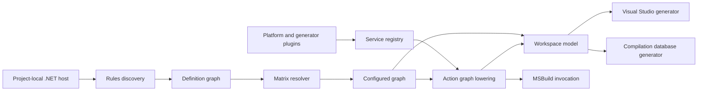

# Architecture

| Field | Value |
|---|---|
| Status | Implemented Windows MVP with planned extension points |
| Version | 0.1 |
| Last updated | 2026-07-21 |

This document describes the architecture implemented in the repository. Future work is isolated in [Planned evolution](#planned-evolution) and is not part of the current product contract.

## Design goals

RoxyBuildTool is a build description compiler embedded in a project-local .NET console application. It converts typed C# rules into immutable intermediate models and then projects those models into build and workspace artifacts.

The design prioritizes:

- Compile-time checking and IDE support for build rules.
- One configuration identity across generators and executors.
- Explicit dependency propagation.
- Deterministic, inspectable generated output.
- Platform and generator extension without core enum or switch changes.
- Early validation before invoking a compiler or MSBuild.

The current implementation does not attempt to be a package manager, a general-purpose scripting runtime, or a replacement for the compiler and linker. IDE projects are generated views, not the source of truth.

## System context

The build host is both the command-line entry point and the compiled rules assembly. `dotnet run` performs normal C# compilation before RoxyBuildTool executes; the tool does not load loose scripts or invoke Roslyn at runtime.



The pipeline separates authoring, resolution, execution semantics, and presentation. A generator receives immutable data and cannot alter build meaning.

## Repository boundaries

| Assembly | Responsibility |
|---|---|
| `RoxyBuildTool.Abstractions` | Stable IDs, diagnostics, plugin contracts, and fragment attributes. |
| `RoxyBuildTool.Model` | Immutable configured, action, artifact, and workspace models. |
| `RoxyBuildTool.Configuration` | Built-in fragments, custom fragment encoding, matrices, constraints, and canonical keys. |
| `RoxyBuildTool.Graph` | Definition graph, dependency resolution, action lowering, and workspace assembly. |
| `RoxyBuildTool.Toolchains` | Platform-independent toolchain descriptors and profile policies. |
| `RoxyBuildTool.CommandLine` | Command and selector parsing. |
| `RoxyBuildTool` | Public authoring facade and in-process application host. |
| `RoxyBuildTool.Platforms.Windows` | Windows x64 and MSVC descriptors. |
| `RoxyBuildTool.Generators.VisualStudio` | Mixed Visual Studio solution and project generation. |
| `RoxyBuildTool.Generators.CompilationDatabase` | `compile_commands.json` generation. |

Dependencies point toward abstractions and immutable models. Core model assemblies do not reference generators. Platform plugins register structured descriptors rather than editing generator templates.

## Build host

`BuildToolApp` owns invocation-scoped state:

- Command-line arguments.
- Workspace root.
- Selected rules assemblies.
- Plugin and service registrations.
- Default generation request.
- Standard output and error streams.
- Optional MSBuild path.
- Maximum configuration-resolution parallelism.
- Incremental generation/action graph cache enablement.

The host uses explicit composition:

```csharp
return await BuildToolApp.Create(args)
    .WithWorkspaceRoot("..")
    .DiscoverRulesFromAssemblyContaining<WindowsMvpRules>()
    .UseWindowsPlatform()
    .UseVisualStudio()
    .UseCompilationDatabase()
    .DefaultGenerate<GameWorkspace>(request => request.Workspace(
        WorkspaceGenerators.VisualStudio2022,
        WorkspaceGenerators.CompilationDatabase))
    .RunAsync();
```

There is no ambient global plugin discovery. Composition remains visible in source, deterministic, and controlled by normal NuGet dependency resolution.

## Rules and definitions

### Discovery

`BuildRegistry` scans selected assemblies for concrete `CxxModule`, `CSharpModule`, `BuildTarget`, and `BuildWorkspace` subclasses. Rules may also be registered explicitly through `IRulesModule`.

Discovered types must be non-generic and have a public parameterless constructor. Definition IDs are derived from type names after removing the conventional `Module`, `Target`, or `Workspace` suffix.

### Configuration methods

`[Configure]` identifies methods that populate a rules object. Methods are ordered by:

1. Lowest declared priority.
2. Unconditional before filtered at the same priority.
3. Method name using ordinal comparison.

Inherited methods allow an abstract target to define common platform axes. Filtered methods are restricted to modules because targets define the matrix itself and workspaces group complete targets.

### Definition graph

The authoring layer produces three definition kinds:

- `ModuleDefinition`: language, output kind, sources, usage requirements, dependencies, native/managed settings, and conditional rules.
- `TargetDefinition`: root modules and a configuration matrix.
- `WorkspaceDefinition`: target set, startup target, and optional imported build host.

Definitions retain no generator-specific XML or project-system objects.

## Configuration identity

### Fragments

A configuration is a set of single-valued fragments. Built-in fragments are:

| Fragment | Current values |
|---|---|
| `Platform` | `Windows` |
| `Architecture` | `X64` |
| `Profile` | `Debug`, `Development`, `Release`, `Shipping` |
| `Toolchain` | `Msvc14.4` |
| `LinkModel` | `Modular`, `Monolithic` |

Projects add dimensions with `[BuildFragment]` enums. Stable IDs use dot-separated PascalCase ASCII segments. Enum integral values and reflection order are not part of serialized identity.

### Canonical keys

`ConfigurationKey` sorts values by fragment ID and serializes them as semicolon-separated assignments:

```text
Architecture=X64;Game.Flavor=Client;LinkModel=Modular;Platform=Windows;Profile=Development;Toolchain=Msvc14.4
```

Each fragment appears at most once. The canonical form drives ordering, selection, manifests, intermediate paths, and semantic identity. A 12-character SHA-256 prefix provides a path-safe short hash; it is not used as the authoritative identity.

### Matrix resolution

Each target declares axes and constraints. The resolver:

1. Applies CLI selectors to each axis.
2. Rejects selectors for fragments absent from the matrix.
3. Expands candidates incrementally.
4. Evaluates constraints after each assignment.
5. Defers a constraint when it references an unassigned fragment.
6. Records the assigned prefix and reason for rejected candidates.
7. Returns canonical keys in stable order.

This avoids constructing the complete Cartesian product before validation and supports `query matrix --why-excluded`.

## Dependency model

Dependencies express propagation and action ordering separately from project presentation.

| Visibility | Current module compile usage | Consumer usage | Action ordering | Runtime propagation |
|---|:---:|:---:|:---:|:---:|
| Private | Yes | No | Yes | From consumed usage |
| Public | Yes | Yes | Yes | From consumed usage |
| Interface | No | Yes | Yes | From exported usage |
| BuildOrderOnly | No | No | Yes | No |
| Runtime | Runtime files only | No | Yes | Yes |

Usage requirements contain ordinary and system include directories, preprocessor definitions, link inputs, and runtime files. Every value carries an origin such as `EngineCore:public`. Union removes duplicate values deterministically and preserves the lexicographically first origin.

The resolver performs a depth-first traversal from target root modules. It diagnoses:

- Dependency cycles with a concrete cycle path.
- References to unregistered modules.
- Required modules disabled by a matching conditional rule.
- Compile or interface usage crossing the native/managed language boundary.

Configuration-dependent module definitions are materialized before dependency propagation.
Target configurations are resolved with bounded parallelism. Each materialized module definition
receives a fresh rules instance. Results are cached by only the configuration fragments referenced
by that module's filtered `[Configure]` methods, while source-directory snapshots are shared for the
invocation. `BuildToolApp.WithMaxParallelism` controls the concurrency bound.

Across invocations, content-addressed action graphs are stored below `.roxy/cache/v1`. Configured
graphs are deduplicated within an invocation and re-resolved across invocations because profiling
shows that resolution is cheaper than rehydrating its expanded usage model. Cache keys include
semantic definitions, registered rule assembly identities,
the canonical configuration, resolver/lowerer module identities, toolchain settings, and workspace
identity. A changed source set or rules build therefore selects a new entry. Corrupt or incompatible
entries are discarded and rebuilt. `BuildToolApp.WithIncrementalCache(false)` disables this cache.
Successful generation also records a small content-hashed snapshot. An identical later request can
validate the owned outputs and manifest, then skip graph construction and generator execution. A
missing or edited output invalidates the snapshot and runs the complete pipeline normally.

## Immutable intermediate representations

### Configured graph

`ConfiguredGraph` is the resolved meaning of one target and one configuration. It contains:

- The canonical configuration key.
- Target identity and root modules.
- Enabled configured modules.
- Resolved compile and consumer usage.
- Diagnostics.

This is the last layer that knows authoring-level dependency visibility.

### Action graph

`ActionGraphLowerer` converts configured modules into explicit actions and artifacts. The current action kinds are:

- C++ and Windows resource compile, archive, and link.
- Runtime file copy.

Managed projects are lowered by the selected project-system backend. The generator-neutral core
does not embed Visual Studio paths or synthesize MSBuild restore/build actions.

An action declares its command, argument array, working directory, inputs, outputs, dependencies, environment-variable allowlist, cache policy, remote-execution eligibility, and sensitive arguments.
Compile and resource actions retain one immutable shared argument prefix per module and a small
action-specific suffix. Consumers can traverse the segmented view without materializing a duplicate
array; the public `Arguments` property remains a contiguous compatibility snapshot.

Commands remain structured until execution or generator output. Shell quoting is not part of the core model.

### Workspace model

`WorkspaceAssembler` groups configured module variants into projects. A project contains:

- Stable project identity and presentation name.
- Language.
- Target/configuration variants.
- Project dependencies with the exact target/configuration variants in which each edge exists.
- Optional imported build-host project.

The model includes the configured and action graphs consumed by workspace generators. Generators therefore do not need to re-resolve rules.

## Toolchains and platforms

A platform plugin registers `PlatformDescriptor` and `ToolchainDescriptor` services. The Windows plugin currently provides:

- Platform `Windows`.
- Architecture `X64`.
- Toolchain `Msvc14.4`.
- `cl.exe`, `rc.exe`, `lib.exe`, and `link.exe` commands.
- Visual Studio platform toolset `v143`.
- Compile and link policies for the four built-in profiles.

Profile policies are toolchain data, not conditionals embedded in the Visual Studio generator. This keeps action semantics available to future executors.

Plugins expose stable IDs, versions, capability sets, an accepted host API range, and required
capabilities. Duplicate IDs are rejected at composition time; compatibility is validated before
any plugin can register services.

## Generators

### Visual Studio

The Visual Studio generator consumes `WorkspaceModel` and produces:

- A solution.
- C++ `.vcxproj` and `.filters` files.
- SDK-style C# project files.
- A generated `Directory.Build.props` for isolated intermediate paths.

The solution maps canonical configurations to unique readable display names and `Win64`. Project files carry compiler settings, references, sources, package references, target frameworks, and dependencies derived from the exact immutable variant. A project that has no matching variant is mapped for IDE display but is not built in that solution configuration.

The full workspace and target-scoped build solutions use different output directories. A command-line build cannot overwrite the solution open in an IDE.

### Compilation database

The compilation database generator selects compile actions from all action graphs and emits one `arguments`-array entry per action. It does not reconstruct compiler arguments from module rules.

## Build execution

The implemented `build` command is intentionally narrow:

1. Resolve selectors to exactly one target configuration.
2. Create a target-scoped workspace definition.
3. Generate a Visual Studio solution.
4. Locate full MSBuild.
5. Invoke restore and build for the selected solution configuration.
6. Return the MSBuild exit code.

Global MSBuild is required because SDK-local MSBuild does not include the Visual C++ targets. The path may be supplied by `WithMsBuild`, `MSBUILD_EXE_PATH`, or standard Visual Studio installation locations.

The action graph is currently used for generation, diagnostics, compilation database output, manifests, and semantic modeling. It is not yet executed directly by a general-purpose local executor.

## Determinism and output ownership

Default output layout:

```text
.roxy/
  cache/v1/actions/<content-hash>.bin
  cache/v1/generation/<request-content-hash>.json
  generated/<generator>/<workspace>/
  manifests/<request-hash>.json
out/<platform>/<architecture>/<profile>/<configuration-hash>/<target>/
intermediate/<configuration-hash>/<target>/
```

Determinism rules:

- Stable IDs and canonical keys use ordinal comparison.
- Collections are sorted before entering generated output.
- Logical paths are workspace-relative and normalized to `/`.
- Generated text is normalized to LF.
- Files are written only when content changes.
- Each generator tracks only its own output paths and removes stale tracked files without deleting unowned files.
- Each action output must have one producer.
- Action dependencies must reference existing action IDs.
- Action IDs, artifact IDs, artifact producers, and dependency cycles are validated before generation writes files.

Action semantic hashes include identity, kind, command, arguments, working directory, inputs, outputs, and dependencies. They intentionally exclude presentation-only workspace settings.

Generation manifests record the request, configurations, action hashes, and plugin versions. They
provide traceability and remain separate from the versioned content-addressed pipeline cache.

## Diagnostics

Diagnostics have a stable code, severity, message, and optional definition, configuration, source location, and help text.

| Range | Owner |
|---|---|
| `RBT0000-RBT0999` | Host and command line |
| `RBT1000-RBT1999` | Fragments and matrices |
| `RBT2000-RBT2999` | Definitions and dependency resolution |
| `RBT3000-RBT3999` | Actions and artifacts |
| `RBT4000-RBT4999` | Generators and generated output |

User-correctable configuration failures return exit code 2. Unexpected infrastructure failures return exit code 1. Generation should fail before invoking an external build tool whenever sufficient information is available.

## Security boundaries

The current model includes explicit environment allowlists and sensitive-argument fields on actions. Generated files and semantic hashes must not contain credentials.

Plugins execute in process and therefore share the build host's trust boundary. RoxyBuildTool does not sandbox plugin code. A repository must treat platform and generator packages as build-time code with the same trust requirements as MSBuild tasks or compiler plugins.

Source, output, and other `LogicalPath` values are workspace-relative; `LogicalPath` rejects rooted
paths and parent traversal. Include usage may intentionally name rooted SDK paths or backend
property expressions, which generators preserve without workspace prefixing. External tool
discovery paths remain invocation context and are not serialized as logical output paths.

## Current limitations

Version 0.1 has the following architectural limitations:

- Windows x64 and MSVC are the only platform and toolchain implementation.
- C++/CLI is intentionally outside the supported capability set.
- Assembly-language inputs, including ASM/MASM/NASM/GAS source files, are intentionally unsupported.
- Visual Studio generation targets the current v143 project model.
- The command host implements generate, build, matrix query, graph query, and explain only.
- The executor option is reserved and does not change execution.
- Build execution is delegated to MSBuild.
- Conditional module mutation supports disable, add define, and remove dependency only.
- Profile policies are fixed by the registered toolchain descriptor.
- Package, deploy, run, test, publish, signing, and remote-execution workflows are not implemented.

## Planned evolution

The following directions are design goals, not commitments of the current API:

1. A local or Ninja executor consuming `ActionGraph` directly.
2. FASTBuild lowering without changing configured graph identity.
3. Linux/Clang and macOS/AppleClang platform packages.
4. Xcode workspace generation.
5. Explicit package, deploy, run, debug, bundle, and signing actions.
6. Cross-compilation with separate host and target toolchains.
7. Source generators and analyzers for earlier rules validation.
8. Public API compatibility baselines and package release automation.

New backends must consume immutable models. New platforms must register descriptors and capabilities without adding platform-specific cases to core configuration or graph assemblies.

## Architectural invariants

Changes to the implementation must preserve these invariants:

1. Rules compile as an ordinary .NET project.
2. A canonical configuration has exactly one value per fragment.
3. Generators never mutate definitions, configured graphs, or action graphs.
4. Workspace presentation does not change binary identity.
5. Dependency visibility has explicit compile, consumer, runtime, and ordering semantics.
6. Generated output has stable ordering and compare-before-write behavior.
7. Commands and arguments remain structured until an execution or emission boundary.
8. Plugins are explicit and identified by stable ID and version.
9. Private SDK credentials and secrets remain outside generated models and files.
10. Unsupported capability combinations fail before external compilation starts.
