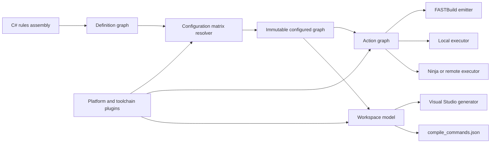

# RoxyBuildTool 总体架构设计

> 状态：Proposed  
> 日期：2026-07-20  
> 参考实现：本机 Sharpmake `2c552ff2`（2026-06-19）  
> 范围：架构与首版实施边界，不代表最终 API 已冻结

## 1. 结论

Roxy 应当实现为一个通过 NuGet 发布的“**强类型构建描述编译器库**”，而不是必须预装的独立生成工具，也不是直接在 C# 配置回调里拼接 `.vcxproj` 或 `.bff` 文本。

每个使用方保留一个很小的 .NET Console App（例如 `Build/RoxyBuild.csproj`）。`dotnet run` 先按正常 .NET 流程编译该项目，再在同一进程中调用 RoxyBuildTool library 完成生成；因此规则天然拥有 IntelliSense、编译期类型检查、断点调试和普通 NuGet 版本锁定。无参数 `dotnet run` 执行项目定义的默认 generate request，其他操作通过 `dotnet run -- <command>` 进入同一入口。

用户规则首先生成不可变的 `ConfiguredGraph`，再降低为与具体后端无关的 `ActionGraph` 和 `WorkspaceModel`：



这里有四个必须分开的概念：

| 概念 | 例子 | 是否影响二进制 | 责任 |
|---|---|---:|---|
| `TargetPlatform` | Windows、Linux、私有 Console A | 是 | ABI、SDK、系统库、打包与部署 |
| `Toolchain` | MSVC、Clang、平台私有编译器 | 是 | 编译、链接、归档命令和能力 |
| `BuildExecutor` | Local、MSBuild、FASTBuild、未来的 Ninja | 原则上否 | 如何执行同一张 action graph |
| `WorkspaceGenerator` | VS 2022、VS 2026、Xcode、Compile DB | 否 | IDE/编辑器如何浏览、构建和调试 |

因此 Visual Studio + FASTBuild 是合法且常见的组合：Visual Studio 负责工作区，FASTBuild 负责真正执行构建。不能用一个类似 Sharpmake `DevEnv` 的枚举同时表达这两件事。

## 2. 目标与非目标

### 2.1 必须满足

- 一份 C# 规则描述 Windows、Linux、macOS 以及游戏主机等多个目标平台。
- 内置 Debug、Development、Release、Shipping 等 profile，并允许项目自定义 profile。
- 支持用户定义强类型 fragment enum，并由多个 fragment 组成配置矩阵。
- 同一份已解析构建图可生成 Visual Studio、FASTBuild、`compile_commands.json` 等后端产物。
- 核心和官方扩展以 NuGet 包交付；clone 项目后只需要合适的 .NET SDK，即可从 build host 目录运行 `dotnet run`。
- 模块依赖的 include path、define、link input 和运行时文件具有明确的 public/private 传播语义。
- C++ 与 C# 是同一领域模型中的一等语言，可生成混合 Visual Studio workspace，并正确处理 ProjectReference、PackageReference、native runtime dependency 和 host tool dependency。
- 平台、工具链、SDK、打包、部署和调试能力可由外部插件提供；核心仓库不需要引用 NDA SDK。
- 生成结果可复现、增量、可解释，错误应在调用编译器前尽早报告。
- 从一开始就能表示 cross-compile、远程执行、package、deploy 和 run，而不是把它们补成零散 post-build script。
- 对 macOS 等 signed-bundle 平台，把 bundle、entitlements、nested signing、notarization 和 credential boundary 建模为正式 artifact/action。

### 2.2 首版不做

- 不在首版实现 C++ 通用包管理器；第三方 C/C++ 库先通过 `ExternalModule` 或预编译 artifact 描述。Roxy 自身及其 .NET 插件仍使用 NuGet 管理。
- 不把 IDE 工程文件作为构建事实来源；它们始终是生成物。
- 不承诺不同执行后端生成字节完全相同，除非 toolchain fingerprint、输入、环境白名单和参数都相同。
- 不在公开仓库实现任何真实主机 SDK 细节。首版使用 `ConsoleDevKit` 假平台验证插件边界。
- 不为了兼容任意 MSBuild 自定义逻辑而允许后端直接修改核心图；特殊能力必须显式建模或通过受控扩展点提供。

## 3. 从 Sharpmake 保留什么、改变什么

本设计定向参考了 Sharpmake 的以下实现：

- `Sharpmake/Target.cs`：`[Fragment, Flags]`、target mask 展开和 fragment filter。
- `Sharpmake/Configurable.cs` 与 `ConfigureCollection.cs`：按 target 调用 `[Configure(...)]` 规则。
- `Sharpmake/PlatformRegistry.cs`、`PlatformAttributes.cs` 和 `docs/Platforms.md`：按平台注册实现，并将 NDA 平台放在独立 DLL 中。
- `Sharpmake.Generators/GeneratorManager.cs`：solution/project generator 的选择。
- `IPlatformVcxproj` 与 `IPlatformBff`：平台参与 Visual Studio 和 FASTBuild 生成的方式。
- `Options.XCode.cs`、Apple platform 实现与 `XCodeProj.cs`：signing/provisioning、Info.plist、bundle、framework/resource phase，以及 Objective-C、Objective-C++、Swift、Metal 文件类型。
- `IApplePlatformBff` 与 FASTBuild `Languages`：Apple/Swift lowering 以及 ObjC、ObjC++、Swift 的后端区分。
- `samples/FastBuildSimpleExecutable`：`BuildSystem.FastBuild | BuildSystem.MSBuild` 配置方式。

保留的思想：

- C# 规则、继承/复用、IDE 补全和可调试性。
- fragment 组成 target/configuration，并从 mask 生成配置组合。
- project/module 与 solution/workspace 分离。
- 平台实现可作为独立程序集加载，NDA 代码无需进入公共核心。
- public/private dependency、unity build、FASTBuild 和多 IDE 生成支持。

Roxy 要主动修正的耦合：

- **不使用固定 `Platform` flags enum。** 平台用稳定字符串 ID 注册，私有主机插件无需在核心枚举中预留 bit。
- **fragment value 是单值，选择集合才是 mask。** 用户不需要手写 `1 << n`，也不会受 32 bit 数量限制；复合选择只存在于 matrix query，不进入最终 configuration key。
- **不让 generator 直接读取并改写可变 project configuration。** 所有后端消费不可变 IR。
- **不按反射或源码声明顺序决定配置结果。** 规则具有明确阶段和优先级；同级冲突是诊断，而不是“最后一次赋值获胜”。
- **平台只表达一次结构化能力。** VS 与 FASTBuild adapter 都消费同一个 toolchain/action/platform 模型，避免分别维护两套平台参数。
- **IDE 与构建执行器正交。** 避免 `DevEnv`、编译器版本和 build system 互相暗示。

## 4. 核心领域模型

### 4.1 `Module`

`Module` 是依赖传播与编译设置的最小复用单元，接近 UnrealBuildTool 的 Module，也对应 Sharpmake 的 Project。原生 C/C++ module 首版支持：

- `HeaderOnly`
- `ObjectLibrary`
- `StaticLibrary`
- `SharedLibrary`
- `ExecutableSupport`（只作为 target 内部组成部分，不单独表示最终产品）
- `External`（预编译库、SDK 或 header-only 第三方依赖）

每个 module 描述 sources、public/private headers、generated sources、usage requirements、dependencies 和受条件约束的规则，但不决定 IDE 文件名。

### 4.2 `Target`

`Target` 是用户可直接选择构建的产物集合。它不带 `Game`、`Editor`、`Server` 等封闭 kind；这些概念若对某个仓库有意义，应由该仓库通过开放 fragment、tag 或自定义规则表达。它决定：

- 根 modules 和 binary layout（monolithic 或 modular）。
- entry point、输出 artifact、staging、package、deploy、run/debug recipe。
- 允许的配置矩阵及跨 module 的最终策略，例如 LTO、sanitizer 和 CRT。

一个 target 可以产生多个 typed artifact，例如 executable、symbols、import library、asset bundle 和 package。

### 4.3 `Workspace`

`Workspace` 是开发者视图，接近 Sharpmake Solution。它选择 target/module 子集、文件夹布局、默认启动 target 和需要暴露的配置，但不参与 ABI 或链接决策。

同一 target 可以出现在 `EngineDevelopers`、`Gameplay`、`CI` 等多个 workspace 中，不能因此产生不同二进制。

### 4.4 `Artifact` 和 `Action`

artifact 必须是带类型的值，而不只是路径：

```text
ObjectFile, StaticLibrary, SharedLibrary, Executable, DebugSymbols,
GeneratedSource, RuntimeFile, AssetBundle, Package, DeployStamp
```

action 至少包括：

```text
Compile, Archive, Link, CodeGenerate, Copy, Strip, Sign,
SwiftCompile, MetalCompile, ProcessInfoPlist, AssembleBundle,
Notarize, Staple,
DotNetRestore, DotNetBuild, DotNetPublish, DotNetTest, DotNetPack,
CookAssets, Package, Deploy, CustomTool
```

每个 action 都显式声明 ID、输入、输出、命令、参数数组、工作目录、依赖、环境变量白名单、响应文件、是否可缓存、是否可远程执行和敏感字段。禁止靠扫描命令字符串推断依赖。

## 5. Fragment 与配置矩阵

### 5.1 内置 fragment

最终的 `ConfigurationKey` 至少包含：

| Fragment | 示例 | 说明 |
|---|---|---|
| `TargetPlatform` | `windows`, `linux`, `vendor.console-a` | 开放 ID，不是封闭 enum |
| `Architecture` | `x64`, `arm64` | 目标 CPU/ABI |
| `BuildProfile` | `debug`, `development`, `release`, `shipping` | 策略集合，不等同于优化等级 |
| `ToolchainId` | `msvc-14.4`, `clang-20`, `console-a-sdk-7` | 可由约束推导，也可显式选择 |
| `LinkModel` | `modular`, `monolithic` | 对部分产品是 ABI 维度 |

`BuildExecutor` 默认属于 generation/build request，而不属于二进制 identity。只有某执行器确实改变编译参数时，差异必须表现为显式 fragment 或 toolchain fingerprint，不能偷偷读取 executor 名称改变规则。

Host OS、SDK 安装路径、IDE 版本通常是 invocation context；只有它们改变 action 或 artifact 时才进入配置 fingerprint。

### 5.2 自定义 fragment enum

用户可以声明任意单选 enum：

```csharp
[BuildFragment("game.flavor")]
public enum GameFlavor
{
    Client,
    DedicatedServer,
    Editor
}

[BuildFragment("render.rhi")]
public enum RenderBackend
{
    D3D12,
    Vulkan,
    PlatformDefault
}
```

要求：

- ID 在整个 rules assembly 和插件集合中唯一，并参与序列化；重命名 C# 类型不应静默改变缓存 key。
- 最终 key 中每种 fragment 恰好一个 value。多选 feature 应建模为独立布尔 fragment 或规范化 `FeatureSet`，不能把 flags 的组合当作一个单值。
- enum 的整数值不进入稳定 ID；稳定形式是 `fragment-id=value-id`。
- source generator 在编译期生成 codec/metadata，并诊断重复 ID、无效默认值和未注册类型。早期原型可使用反射 fallback，但公共契约不依赖字段顺序。

### 5.3 Matrix API

规则作者声明候选集合、约束和推导，而不是手写完整笛卡尔积：

```csharp
Matrix
    .Axis(Platforms.Windows, Platforms.Linux, ConsoleA.Platform)
    .Axis(Architectures.X64, Architectures.Arm64)
    .Axis(BuildProfiles.Debug, BuildProfiles.Development, BuildProfiles.Shipping)
    .Axis(GameFlavor.Client, GameFlavor.DedicatedServer, GameFlavor.Editor)
    .Axis(RenderBackend.D3D12, RenderBackend.Vulkan, RenderBackend.PlatformDefault)
    .Exclude(c => c.Is(Platforms.Linux) && c.Is(RenderBackend.D3D12),
             "D3D12 is not available on Linux")
    .Require(c => c.Is(GameFlavor.Editor), c => c.Is(BuildProfiles.Shipping).Not(),
             "Editor is never shipped")
    .Derive<ToolchainId>(ToolchainSelection.ForHostAndPlatform);
```

Matrix resolver 必须：

1. 先合并 CLI selector 和 workspace selector，尽早缩小候选集。
2. 懒展开组合，并在每个新增维度后执行约束，避免无意义的完整笛卡尔积。
3. 输出规范化、稳定排序的 `ConfigurationKey`。
4. 为被排除组合保留 reason，支持 `dotnet run -- query matrix --why-excluded ...`。
5. 检测 dependency target 映射的零匹配和多义匹配。

### 5.4 Profile 是策略，不是一个优化开关

`BuildProfile` 提供一组默认 policy：optimization、debug info、assert、logging、incremental linking、LTO、symbol handling、runtime library 和 strip 策略。模块或 target 可以覆盖其中允许覆盖的设置。

Profile value 与 platform 一样使用开放的稳定 ID。项目可以注册继承已有 profile 的新策略，而不必修改 core：

```csharp
public static readonly BuildProfileId Qa = new("qa");

registry.Profiles.Add(
    BuildProfile.Define(Qa)
        .Inherit(BuildProfiles.Development)
        .Set(CompilerPolicy.Optimization, OptimizationMode.Speed)
        .Set(RuntimePolicy.Assertions, true)
        .Set(RuntimePolicy.VerboseLogging, true));
```

Profile 继承在注册阶段展开并检测 cycle。最终 `ConfigurationKey` 只保存 `profile=qa`，展开后的设置及来源保存在 `ConfiguredGraph`。

建议内置语义：

| Profile | 优化 | 调试信息 | Assert/日志 | LTO/Strip |
|---|---|---|---|---|
| Debug | 低或关闭 | 完整 | 开启 | 关闭 |
| Development | 适中 | 完整 | 开启 | 关闭 |
| Release | 高 | 可保留独立 symbols | 可配置 | 可配置 |
| Shipping | 高 | 独立受控 symbols | 最小 | 开启 |

具体 compiler flag 由 toolchain lowering 决定；profile 不能直接写 `/O2` 或 `-O3`。

## 6. 规则系统与确定性

### 6.1 NuGet library + Console App 宿主

规则项目本身就是 generation host，同时也是 rules assembly。Roxy 不负责在运行时再次调用 Roslyn 编译用户脚本，`dotnet run` 已经完成这一步。

推荐目录：

```text
Build/
  RoxyBuild.csproj
  Program.cs
  GameRules.cs
  Modules/
  Targets/
  Workspaces/
```

最小项目文件：

```xml
<Project Sdk="Microsoft.NET.Sdk">
  <PropertyGroup>
    <OutputType>Exe</OutputType>
    <TargetFramework>net10.0</TargetFramework>
    <Nullable>enable</Nullable>
    <ImplicitUsings>enable</ImplicitUsings>
    <RestorePackagesWithLockFile>true</RestorePackagesWithLockFile>
  </PropertyGroup>

  <ItemGroup>
    <PackageReference Include="RoxyBuildTool" Version="0.1.0" />
    <PackageReference Include="RoxyBuildTool.Platforms.Windows" Version="0.1.0" />
    <PackageReference Include="RoxyBuildTool.Generators.VisualStudio" Version="0.1.0" />
    <PackageReference Include="RoxyBuildTool.Backends.FastBuild" Version="0.1.0" />
  </ItemGroup>
</Project>
```

最小入口：

```csharp
using Game.Build;
using RoxyBuildTool;
using RoxyBuildTool.Backends.FastBuild;
using RoxyBuildTool.Generators.VisualStudio;
using RoxyBuildTool.Platforms.Windows;

return await BuildToolApp.Create(args)
    .WithWorkspaceRoot("..")
    .DiscoverRulesFromAssemblyContaining<GameRules>()
    .UseWindowsPlatform()
    .UseVisualStudio()
    .UseFastBuild()
    .DefaultGenerate<GameWorkspace>(request => request
        .Workspace(WorkspaceGenerators.VisualStudio2022)
        .Executor(BuildExecutors.FastBuild))
    .RunAsync();
```

由此得到两种等价用法：

```powershell
# 在 Build/ 目录：生成 Program.cs 中声明的默认 workspace
dotnet run

# 显式命令和 selector；-- 用于分隔 dotnet run 与 Roxy 参数
dotnet run -- generate GameWorkspace --workspace vs2022 --executor fastbuild
dotnet run -- build GameEditor --platform windows --profile development
```

`BuildToolApp` 是 library 提供的 in-process command host。它负责参数解析、日志、取消、退出码、默认命令以及后续各 phase 的编排；不能依赖全局安装的 dotnet tool。未来可以额外发布 `dotnet-roxy-build` 作为便利包装，但它不能成为 build 的唯一入口。

rules 是普通 C# 类型。Build host 显式指定要扫描的 assembly；该 assembly 内所有非抽象的 `CxxModule`、`CSharpModule`、`BuildTarget` 和 `BuildWorkspace` 都按完整类型名排序后自动发现：

```csharp
public sealed class GameRules; // assembly marker
```

runtime 不扫描整个 `AppDomain`，避免把任意依赖包中的类型意外注册；assembly scan 是显式 opt-in，并输出稳定的发现清单。插件也优先由 `Program.cs` 显式注册。每个 module 声明文件放在对应 module 的源码目录中，例如 `Engine/Core/EngineCore.Module.cs`；Build host 用编译 glob 收集这些声明，而实际产品 source glob 排除 `*.Module.cs`。

Module、Target 和 Workspace 都是 marker 基类，没有必须 override 的 `Configure` 方法。规则入口统一使用反射发现的 `[Configure]` 方法：

```csharp
[Configure]
private static void ConfigureAll(ModuleRules rules) { }

[Configure<GameFlavor>(nameof(GameFlavor.DedicatedServer), Priority = 100)]
private static void ConfigureServer(ModuleRules rules) { }
```

同一个 attribute 中的值是 OR；不同 fragment 的 attribute 是 AND。`Priority` 控制跨方法的稳定应用顺序，同优先级再按方法名排序。Target/Workspace 的无条件 `[Configure]` 可通过抽象基类继承，用于共享平台矩阵；Module 的带 fragment `[Configure]` 在 configuration 解析后应用。

### 6.2 规则层级

推荐按固定 phase 应用：

1. Core defaults
2. Toolchain defaults
3. Platform policy
4. Profile policy
5. Module rules
6. Target rules
7. Explicit invocation overrides

每个属性保存 `Value + Origin + Phase`。同一 phase 对 single-value 属性给出两个不同值时立即报错；可合并集合使用明确的 `Add/Remove/Replace` 操作。`dotnet run -- explain` 应能展示最终值的来源链。

条件规则使用强类型 predicate，而不是靠函数名或反射顺序：

```csharp
rules.When<BuildProfile>(BuildProfiles.Debug)
     .Set(CompilerPolicy.Optimization, OptimizationMode.Off)
     .AddDefine("ROXY_DEBUG=1");

rules.When<GameFlavor>(GameFlavor.DedicatedServer)
     .RemoveDependency<RendererModule>();
```

任意读取当前时间、随机数、用户全局环境或网络的规则会破坏可复现性。规则上下文只暴露声明过的 inputs；访问环境变量必须通过 `ctx.Inputs.Environment.Require("NAME")`，并进入 generation fingerprint。

## 7. 依赖和 usage requirements

依赖边采用接近现代 CMake 的三种可见性，替代难以解释的位掩码：

| 依赖类型 | 当前 module 编译可见 | 当前 module 链接可见 | 向依赖者传播 |
|---|---:|---:|---:|
| `Private` | 是 | 是 | 否 |
| `Public` | 是 | 是 | 是 |
| `Interface` | 否 | 否 | 是 |

传播的结构化 `UsageRequirements` 包括：

- include directories（普通/system/framework 分类）
- compile definitions 和语言标准要求
- link artifacts 与 link options
- runtime artifacts、delay-load、framework/package requirement
- tool/codegen requirements

`BuildOrderOnly` 是独立 edge kind，只增加 action 顺序，不传播编译或链接属性。运行时 staging 也用显式 `RuntimeDependency`，不由 link dependency 猜测。

依赖解析针对 `ConfigurationKey` 执行。默认传递同名 fragment；不兼容时必须由 dependency mapping 显式转换，例如 Editor target 可以把第三方库的 `GameFlavor` 维度投影掉。解析后检测 cycle、ODR 风险、架构/CRT/ABI 不兼容、重复 artifact producer 和缺失 runtime file。

## 8. 中间表示与流水线

### 8.1 三层 IR

1. `DefinitionGraph`：用户声明的 module、target、workspace、matrix 和条件规则。
2. `ConfiguredGraph`：给定 configuration 后，所有规则已求值、依赖已解析的不可变图。
3. `ActionGraph` / `WorkspaceModel`：前者描述实际构建 DAG，后者描述 IDE 视图。

平台和工具链只允许在明确的 lowering phase 把 `ConfiguredGraph` 转成 actions，不能在 generator 中反向修改 module 配置。

### 8.2 完整流水线

```text
restore/build the Console App through dotnet run
-> start BuildToolApp and register referenced plugins
-> register definitions and fragment metadata
-> select and resolve configuration matrix
-> evaluate phased rules
-> resolve dependency graph and usage requirements
-> validate capabilities and ABI compatibility
-> lower configured graph to typed action graph
-> build workspace model
-> validate action inputs/outputs and cycles
-> emit requested executor/workspace files
-> compare-and-write atomically
-> write generation manifest and diagnostics
```

所有集合在进入 IR 时规范化并稳定排序。路径使用逻辑 workspace-relative 形式存储，到 emitter 边界才转换为目标格式。生成器必须 compare-before-write，避免每次生成都触发 IDE reload。

## 9. 后端设计

### 9.1 Backend contracts

建议最小接口：

```csharp
public interface IActionGraphEmitter
{
    BackendId Id { get; }
    BackendCapabilities Capabilities { get; }
    GenerationResult Emit(ActionGraph graph, GenerationContext context);
}

public interface IWorkspaceGenerator
{
    WorkspaceGeneratorId Id { get; }
    WorkspaceCapabilities Capabilities { get; }
    GenerationResult Generate(WorkspaceModel workspace, GenerationContext context);
}
```

每个后端先声明 capability，例如 PCH、unity、distributed compile、custom action、response file、dynamic library、package action 和某平台支持。选择后端时一次性验证；不能到模板中途才因 `null` platform adapter 失败。

一次 generation request 可以选择多个 workspace generator 或辅助 emitter，例如同时生成 VS 2022 和 Compile DB；configuration 解析和 action lowering 只执行一次。不同 executor 若需要不同的调度 metadata，应在共享 semantic action 之上增加 executor view，不能重新运行用户规则。

### 9.2 FASTBuild

FASTBuild emitter 消费 action graph：

- `Compile` -> `ObjectList` 或 `Unity + ObjectList`
- `StaticLibrary` -> `Library`
- `Link` -> `Executable` / `DLL`
- `Copy/Package/CustomTool` -> `Copy` / `Exec` / `Alias` / `Stamp`
- graph edge -> `PreBuildDependencies` 或输入 artifact dependency

compiler 定义来自 resolved toolchain，平台插件提供的是结构化 toolchain/runtime/package 信息，不再实现一份与 Visual Studio 重复的 `IPlatformBff` 大接口。FASTBuild 专有调度选项（cache、distribution、concurrency group）属于 executor policy，不污染 module 的通用 compiler settings。

### 9.3 Visual Studio

Visual Studio generator 消费 `WorkspaceModel` 和 actions 的摘要：

- `executor=msbuild` 时可生成 native `.vcxproj`，由 MSBuild 执行 compile/link actions。
- `executor=fastbuild` 时生成 Makefile/NMake 风格 project，Build/Rebuild/Clean 调用 repository-local build host（例如 `dotnet run --project Build/RoxyBuild.csproj --no-restore -- build ...`）或 FBuild alias；IntelliSense 数据仍来自 `ConfiguredGraph`。
- `.sln/.slnx` 只表达 workspace、configuration mapping、project dependency、启动与调试信息。
- IDE configuration display name 与内部 canonical key 分离，重名时应报错而不是静默合并。
- 稳定 ID 与 canonical key 使用小写 kebab-case；面向人的工程文件名使用类型派生的 PascalCase，configuration 显示为首字母大写、以空格分隔（例如 `Development Client`）。Windows 的内部 architecture 仍为 `x64`，solution display platform 映射为 `Win64`。

平台专有 VS 属性通过 typed `WorkspaceContribution` 加入，例如 debugger type、deploy rule、SDK property 和平台 toolset ID。禁止插件直接向任意 XML 位置注入字符串；确有必要的 escape hatch 必须带 namespace、版本和诊断信息。

### 9.4 其他生成器

`compile_commands.json` 直接从 compile actions 生成，因此不会与 FASTBuild/VS 的 flags 漂移。后续 Ninja、本地 executor、Xcode 和远程执行都应复用同一 action graph。

## 10. C# / .NET 支持

### 10.1 领域模型

C# 不能作为 Visual Studio generator 的附加特例；它必须在 `DefinitionGraph`、`ConfiguredGraph`、artifact 和 action 层都是一等语言。

`CSharpModule` 表示一个 managed assembly，依赖传播单位也对应一个 assembly/project。建议首版 output kind：

```text
ClassLibrary, ConsoleApplication, WindowsApplication,
TestAssembly, Analyzer, SourceGenerator
```

`CSharpTarget` 选择入口 module，并定义 build、test、publish 或 pack 结果。一个 C# target 可以产生：

```text
ManagedAssembly, ReferenceAssembly, ManagedSymbols, XmlDocumentation,
DepsJson, RuntimeConfigJson, AppHost, NuGetPackage, PublishedDirectory
```

拟议规则 API：

```csharp
using RoxyBuildTool;

public sealed class EditorAutomation : CSharpModule
{
    [Configure]
    private static void ConfigureAll(CSharpModuleRules rules)
    {
        rules.Output = CSharpOutput.ClassLibrary;
        rules.TargetFrameworks.Add(DotNetFrameworks.Net10);
        rules.Sources.From("Engine/Editor/Automation", "**/*.cs");

        rules.Nullable = NullableMode.Enable;
        rules.ImplicitUsings = true;
        rules.LanguageVersion = CSharpLanguageVersion.LatestMajor;

        rules.Dependencies.Public<BuildProtocol>();
        rules.Packages.Add("Microsoft.Extensions.Logging.Abstractions", "10.0.0");
        rules.Analyzers.Add<EngineAnalyzers>();
    }
}

public sealed class EditorAutomationTarget : BuildTarget
{
    [Configure]
    private static void ConfigureTarget(TargetRules rules)
    {
        rules.EntryModule<EditorAutomation>();
        rules.Publish.Mode = DotNetPublishMode.FrameworkDependent;
    }
}
```

支持的结构化属性至少包括：TFM、RID、output kind、assembly/root namespace、language version、nullable、implicit usings、unsafe、warning policy、define、resource/content、analyzer、source generator、`AdditionalFiles`、`PackageReference`、`FrameworkReference` 和 publish options。用户仍可添加受控的 MSBuild property，但必须带类型或明确标记为 backend escape hatch。

### 10.2 TFM、RID 与 RoxyBuildTool configuration

`TargetFrameworkId` 和 `RuntimeIdentifier` 使用开放 ID，不复用 `TargetPlatform`：

- TFM（如 `net10.0`、`netstandard2.1`）决定可用 API surface。
- RID（如 `win-x64`、`linux-arm64`）决定 runtime/native assets 和 publish 结果。
- `TargetPlatform + Architecture` 仍是整个 build graph 的平台身份。

RID 默认由 platform/architecture/plugin 推导；framework-dependent library 可以没有 RID。multi-target module 会为每个 TFM 产生独立 artifact variant，dependency resolver 按兼容 TFM 选择引用，零匹配或多义匹配必须报错。

RoxyBuildTool profile 映射成生成项目中的 MSBuild `Configuration`，但 profile policy 仍是事实来源：

| RoxyBuildTool profile | 典型 C# policy |
|---|---|
| Debug | `Optimize=false`、portable/full PDB、`DEBUG;TRACE` |
| Development | `Optimize=true`、portable PDB、assert/logging 开启 |
| Release | `Optimize=true`、deterministic、独立 symbols |
| Shipping | `Optimize=true`、受控 trim/AOT、最小 diagnostics |

自定义 fragment 需要出现在 IDE configuration identity 时，由 workspace generator 生成稳定 display name；它不能被丢失或只藏在一个不透明 hash 中。

### 10.3 `.csproj` 与执行模型

首版不直接拼装 `csc` 的逐文件 action。RoxyBuildTool 从 `ConfiguredGraph` 生成 SDK-style `.csproj`，再把 managed build 表示为 coarse-grained typed actions：

```text
DotNetRestore -> DotNetBuild -> DotNetTest / DotNetPublish / DotNetPack
```

这样能复用 MSBuild 的 reference resolution、NuGet restore、analyzer/source generator、resource 和 SDK workload 语义，同时 action graph 仍知道输入、输出、依赖和 cache boundary。每个 action 使用参数数组调用 `dotnet`/MSBuild，禁止生成不可分析的 shell script。

生成器要求：

- `.csproj` 与 `.vcxproj` 可以出现在同一 `.sln/.slnx`。
- C# project 的 build settings、ProjectReference 和 configuration mapping 只来自同一 `ConfiguredGraph`。
- intermediate/output path 带 configuration hash，避免不同自定义 fragment 互相覆盖。
- 默认启用 deterministic build、`PathMap` 和 locked restore；CI 可以启用 `ContinuousIntegrationBuild`。
- compare-before-write，且 package restore credential 不进入日志、manifest 或 fingerprint。
- 已存在且不由 RoxyBuildTool 生成的 SDK project 可通过 `ImportedDotNetProject` 接入，但必须声明 configuration/output mapping。

`Build/RoxyBuild.csproj` 本身是用户维护的 build host，不由 RoxyBuildTool 重新生成。Workspace 可以选择把它作为 `Build Rules` solution folder 下的 imported project，方便开发者编辑和调试规则。

### 10.4 NuGet 与依赖语义

C# 依赖沿用 public/private/interface 图，但 lowering 规则与 C++ 不同：

- C# -> C#：生成 `ProjectReference`，或对 external package 生成 `PackageReference`。
- C# -> native shared library：使用 `NativeRuntimeDependency` + `BuildOrderOnly`，负责 staging；不能伪装成 managed ProjectReference。
- C# -> C++/CLI：Windows/MSVC 下可以是 ProjectReference，需平台 capability 支持。
- native -> C# build tool：使用 `ToolDependency`，先为 host platform 构建/运行 managed tool，再消费 generated artifacts。
- native host 嵌入 .NET runtime：使用显式 `ManagedHostDependency`，声明 hostfxr/runtime files 和部署要求。

RoxyBuildTool 自己计算 managed compile/reference closure，并在生成项目中显式写出结果，不能依赖 MSBuild 偶然的 transitive reference 行为。`Public` dependency 可以进入下游 reference closure；`Private` 只供当前 assembly 编译；`Interface` 只加入依赖者。若 public API 暴露了 private assembly 中的类型，analyzer 应报告 API leakage。

NuGet package graph 与 RoxyBuildTool 自身的 package graph 是两件事：前者属于被构建产品，后者属于 build host。产品依赖支持 Central Package Management、`packages.lock.json`、locked mode、private feed 和 source mapping；凭据只由标准 NuGet credential provider 处理。

### 10.5 FASTBuild、平台和 AOT

FASTBuild 首版把 `DotNetBuild` 作为 coarse-grained `Exec`/alias node 接入总 DAG，默认 local-only，不声称能分发单个 C# compile。它仍能正确排序 C++ library、managed wrapper、codegen、publish 和 package。未来只有在 action/input semantics 足够完整时，才考虑 direct `csc` lowering。

平台 capability 必须声明：

```text
SupportedTargetFrameworks, SupportedRuntimeIdentifiers,
ManagedRuntimeMode, SupportsSelfContained, SupportsTrimming,
SupportsReadyToRun, SupportsNativeAot, SupportsCppCli
```

不能假定所有游戏主机都能运行 .NET。主机插件可以拒绝 managed target、只允许 host-side C# tools，或提供厂商支持的 AOT/runtime lowering。失败应发生在 matrix/capability validation 阶段，而不是 publish 或部署后。

首版 C# 验收用例：

1. C# class library + console app 能生成 SDK-style projects 并在 VS 中构建。
2. 同一 workspace 同时包含 `.csproj`、`.vcxproj` 和 build host project。
3. C# app 的 native runtime dependency 按配置正确构建和 staging。
4. host C# code generator 可以生成 C++ target 的输入，且 action graph 无隐式顺序。
5. custom profile/fragment、multi-TFM 和 RID 的输出互不覆盖。
6. FASTBuild graph 能调用 managed build，但不会把不安全的 managed action 错误标为 distributable。

## 11. 平台、工具链与游戏主机插件

### 11.1 Platform adapter 就是普通 .NET 包

平台扩展是标准 SDK-style class library，通过 `dotnet pack` 生成普通 `.nupkg`。它不需要 `plugin.json`、特殊目录协议或自定义 assembly loader。公开平台发布到 nuget.org，NDA 平台发布到厂商或团队的私有 NuGet feed。

平台包引用小型 contract package，并用 C# 类型实现能力：

```csharp
namespace RoxyBuildTool;

public readonly record struct PlatformId(string Value);

public interface IBuildToolPlugin
{
    BuildToolPluginId Id { get; }
    ApiVersionRange SupportedApiVersions { get; }
    void Register(IPluginRegistry registry);
}
```

package 自己提供强类型扩展方法，使用方在 `Program.cs` 显式启用：

```csharp
using Vendor.RoxyBuildTool.Platforms.ConsoleA;

return await BuildToolApp.Create(args)
    .AddRules<GameRules>()
    .UseConsoleA()
    .RunAsync();
```

`UseConsoleA()` 内部注册实现 `IBuildToolPlugin` 的普通对象。NuGet dependency/version range 负责包解析，`SupportedApiVersions` 在启动时提供清晰的兼容性诊断。无需再用 JSON 重复描述已经存在于程序集和 NuGet metadata 中的信息。重复注册同一 `(capability, platform, toolchain)` 直接报错。

建议拆分 capability：

```text
IPlatformDescriptor
IPlatformSdkLocator
IToolchainProvider
IPlatformPolicy
IPackageProvider
IDeployProvider
IRunProvider
IDebuggerIntegration
IWorkspaceContributionProvider
```

一个插件不必实现所有接口。例如只提供 console deploy 工具的插件可以依赖另一个 toolchain 插件。

平台 ID 仍使用稳定字符串而不是核心 enum bit，所以新增私有平台不需要修改或重新发布 core。公开 API 的根 namespace 统一为 `RoxyBuildTool`；`Roxy` 保留给游戏引擎自身。

### 11.2 主机平台边界

真实主机适配放在私有仓库并像普通库一样 pack：

```xml
<Project Sdk="Microsoft.NET.Sdk">
  <PropertyGroup>
    <TargetFramework>net10.0</TargetFramework>
    <PackageId>Vendor.RoxyBuildTool.Platforms.ConsoleA</PackageId>
    <IsPackable>true</IsPackable>
  </PropertyGroup>

  <ItemGroup>
    <PackageReference Include="RoxyBuildTool.Abstractions" Version="[1.0,2.0)" />
  </ItemGroup>
</Project>
```

核心只知道 `PlatformId`、capability contracts 和 opaque SDK/toolchain handle。私有 SDK 类型、头文件位置、注册表键、license 检测、签名、打包、部署协议与 debugger 信息都留在插件中。

主机插件典型流程：

1. `IPlatformSdkLocator` 探测已安装 SDK，返回版本、逻辑 root 和 fingerprint；不在 generation manifest 中泄露 secret/license token。
2. `IPlatformPolicy` 验证 profile、architecture、link model、RHI 等组合，并添加系统 usage requirements。
3. `IToolchainProvider` 把 compile/archive/link 规则降低为 actions。
4. `IPackageProvider` 从 executable、assets、metadata 生成 package actions。
5. `IDeployProvider` 和 `IRunProvider` 生成显式、默认不可缓存的 device actions。
6. `IDebuggerIntegration` 向 workspace 提供启动、部署和调试 recipe。

插件与 build host 处在正常的默认 load context，由 .NET/NuGet 处理 dependency resolution。首版不支持 loose DLL 目录或运行时下载插件，避免引入 `AssemblyLoadContext`、type identity 和依赖冲突问题。API contract 单独放在小型、版本化的 `RoxyBuildTool.Abstractions` 包；核心升级必须用 contract tests 验证旧插件。

### 11.3 主机适配的测试替身

公开仓库应实现 `RoxyBuildTool.Platforms.ConsoleDevKit`：使用普通 Clang/MSVC 和假的 package/deploy 命令，但覆盖完整 console capability。CI 用它验证：

- 私有 platform ID 能在不修改 core 的情况下注册。
- SDK 缺失、版本不兼容、license 不可用时 fail closed。
- VS + FASTBuild 组合可携带 package/deploy/debug recipe。
- 日志、manifest 和 cache key 不泄露标记为 sensitive 的值。
- 未引用私有 package 时，读取不涉及该平台的 rules 仍然成功。

### 11.4 Apple 平台族：语言、bundle 与签名

Sharpmake 已经证明这些需求是真实且相关的：其 `Options.XCode.cs` 提供 signing identity、entitlements、development team、provisioning、bundle/Info.plist 和 Swift 设置；`XCodeProj` 识别 `.m`、`.mm`、`.swift`、`.metal`、storyboard、xib、asset catalog，并生成 sources/resources/framework/embed phases；FASTBuild generator 也区分 ObjC、ObjC++ 与 Swift。RoxyBuildTool 因此应正式设计 Apple pipeline。

Apple 支持由两个普通 NuGet 包提供：

```text
RoxyBuildTool.Platforms.Apple       # SDK/toolchains/platform/bundle/signing
RoxyBuildTool.Generators.Xcode      # .xcodeproj/.xcworkspace/scheme
```

第一阶段实现 `macos`，其公共模型可扩展到 `ios`、`tvos`、`watchos`、`maccatalyst`。SDK discovery 必须记录 Xcode/SDK/toolchain fingerprint 和 minimum deployment target。实际编译、bundle、签名与 notarization 需要 macOS host；非 macOS 机器只能在不解析本机 SDK 的模式下生成纯 workspace，或把 actions 提交给声明过能力的 remote Mac executor。

#### 11.4.1 混合语言与 Cocoa bridge

原生 module 的 source language 扩展为：

```text
C, Cpp, ObjectiveC, ObjectiveCpp, Swift, Metal
```

默认由扩展名推导，规则可逐文件显式覆盖。Objective-C/Objective-C++ 共用 AppleClang toolchain，但有各自的 ARC、exception、language standard 和 compile options。Swift 使用 `SwiftCompile` action 和 Swift driver/module semantics，不能伪装成独立的 C++ compile action；Metal 使用 `MetalCompile` 产生 shader library artifact。

引擎通常仍保持跨平台 C++ core，只添加很薄的平台 frontend：

```csharp
public sealed class MacWindowFrontend : NativeModule
{
    [Configure]
    private static void ConfigureAll(NativeModuleRules rules)
    {
        rules.Sources.Add("Platform/Mac/MacWindow.mm", SourceLanguage.ObjectiveCpp);
        rules.Apple.ObjectiveC.AutomaticReferenceCounting = true;
        rules.Apple.Frameworks.System.Add("AppKit");
        rules.Apple.Frameworks.System.Add("QuartzCore");
        rules.Dependencies.Private<EngineCore>();
    }
}

public sealed class MacLauncher : NativeTarget
{
    [Configure]
    private static void ConfigureTarget(TargetRules rules)
    {
        rules.When(TargetPlatforms.MacOS)
             .RootModules.Add<MacWindowFrontend>();

        rules.Product = AppleProduct.Application;
        rules.Apple.Bundle.Identifier = "com.example.game";
        rules.Apple.InfoPlist.Set("NSHighResolutionCapable", true);
    }
}
```

这允许 `.mm` 文件调用 Cocoa/AppKit 创建窗口，同时直接桥接 C++ engine。Swift interop 还需结构化表达：bridging header、generated `ModuleName-Swift.h`、module map、Swift module name、header visibility 和 C/ObjC module dependency。RoxyBuildTool 不自动生成业务 bridge 代码，但会正确建模并排序这些生成物和编译输入。

framework dependency 不是普通 link string，至少区分：

```text
System, Developer, User, Weak, Embedded
```

Embedded framework 产生独立 copy/embed action，可带 `CodeSignOnCopy` 和 `RemoveHeadersOnCopy` policy。资源也使用 typed inputs：plist、entitlements、storyboard/xib、asset catalog、localized resources、icons 和 Metal sources。

#### 11.4.2 Bundle 与签名计划

`AppleBundleArtifact` 表示 `.app`、`.framework`、`.bundle`、`.xctest` 或 `.xcarchive`，包含 bundle identifier、display/version、Mach-O、Info.plist、resources、embedded frameworks、plugins/extensions 和 entitlements。Info.plist 支持三层 merge：platform defaults < target typed settings < optional user plist；重复 key 的不兼容值给出来源诊断。

签名不是 linker flag，也不能是随意的 post-build script。平台 lowering 生成不可变 `SigningPlan`：

```text
Unsigned / AdHoc / Development / DeveloperId / AppStore
IdentitySelector, TeamId, Entitlements, HardenedRuntime,
TimestampPolicy, ProvisioningProfileSelector
```

identity 与 profile 使用逻辑 selector，不把 certificate private key、keychain password、notary credential 或 App Store Connect key 写入 rules、manifest、日志或 cache key。`ISigningMaterialProvider` 只在执行时从 Keychain、CI secret provider 或授权 remote Mac 解析实际材料。

典型 artifact/action 顺序：

```text
compile/link per architecture
-> lipo universal Mach-O (if requested)
-> assemble bundle and process Info.plist/resources
-> sign nested frameworks/helpers/extensions from inside out
-> sign outer app
-> create archive/package
-> notarize upload (optional, networked and non-cacheable)
-> staple ticket (optional)
```

任何会修改 executable、bundle contents、entitlements 或 embedded component 的 action 必须发生在对应签名之前；validator 检测 sign 后 mutation。sign/notarize 默认 local-only、non-distributable、non-cacheable。unsigned compile/link outputs 仍可远程缓存，签名后的 artifact 另有 provenance。

#### 11.4.3 Xcode 与 FASTBuild 一致性

同一个 `SigningPlan` 和 `AppleBundleArtifact` 支持两种执行方式：

- Native Xcode：generator 映射为 `CODE_SIGN_IDENTITY`、`CODE_SIGN_ENTITLEMENTS`、`DEVELOPMENT_TEAM`、provisioning、Info.plist、framework/resource/embed phase 和 scheme/archive settings。
- FASTBuild/hybrid：C/C++/ObjC/ObjC++（以及后端明确支持时的 Swift）由 FASTBuild 执行；bundle/resource/signing 作为 action graph 中的 Apple actions 执行，Xcode project 只作为 IDE/legacy wrapper。

generation request 必须明确选择每类 action 的 owner，禁止 Xcode 和 FASTBuild 同时链接、复制或签名同一 artifact。若所选 FASTBuild 版本/Apple adapter 不支持 Swift，capability resolver 可以把 Swift/bundle 阶段委托给 `xcodebuild`，或在生成前拒绝该组合。

Apple 验收用例：

1. Objective-C++ module 链接 AppKit 并调用 C++ core 创建 Cocoa window。
2. Swift module + bridging header + ObjC/C++ bridge 的依赖顺序正确。
3. x64/arm64 先合成 universal Mach-O，再进行一次最终签名。
4. embedded framework 在 outer app 之前签名，sign 后 mutation 会被 validator 拒绝。
5. Debug ad-hoc/development 与 Shipping Developer ID/notarization policy 可分离。
6. Xcode native 和 FASTBuild/hybrid 从同一 bundle/signing model 生成，且不会重复 owner。
7. certificate、keychain 与 notarization secret 不出现在 generated files、日志或 fingerprint 中。

## 12. NuGet 发布、宿主与程序集边界

### 12.1 包布局

`RoxyBuildTool` 是用户引用的稳定 facade 和 in-process host 包。功能较大的平台/generator/backend 独立发布，避免所有项目下载不需要的 SDK adapter：

| Package | 内容 |
|---|---|
| `RoxyBuildTool` | authoring facade、`BuildToolApp`、CLI parser、核心 orchestration；传递引用必要的 abstractions/model |
| `RoxyBuildTool.Rules.Sdk` | analyzer/source generator；其 analyzer assets 直接包含在 facade package 中，高级用户也可直接引用 |
| `RoxyBuildTool.Platforms.Windows` | Windows descriptor、SDK locator 和 toolchains |
| `RoxyBuildTool.Platforms.Linux` | Linux descriptor 和 toolchains |
| `RoxyBuildTool.Platforms.Apple` | macOS/Apple SDK、AppleClang/Swift、bundle/signing/notarization |
| `RoxyBuildTool.Generators.VisualStudio` | VS workspace generator 与 MSBuild emitter |
| `RoxyBuildTool.Generators.Xcode` | Xcode project/workspace/scheme generator |
| `RoxyBuildTool.Backends.FastBuild` | FASTBuild action graph emitter/executor policy |
| `RoxyBuildTool.Generators.CompilationDatabase` | Compile DB emitter |
| `Vendor.RoxyBuildTool.Platforms.ConsoleA` | 私有 feed 中的主机插件及可选 VS contribution |

内部可以继续拆分 `RoxyBuildTool.Abstractions`、`RoxyBuildTool.Model` 等程序集，但普通用户只需要直接引用 facade 和自己选择的插件包。所有官方包使用同一 release train；插件通过 NuGet dependency range 和 `SupportedApiVersions` 声明兼容范围。

`RoxyBuildTool` 不应通过 `buildTransitive` 注入会悄悄改变用户编译的复杂 MSBuild targets。NuGet 资产只用于 analyzer/source generator、默认 schema 或受版本控制的模板；generation 必须由 `Program.cs` 对 RoxyBuildTool library 的显式调用触发。

主机平台推荐以私有 NuGet feed 分发。项目把 package version 和 feed mapping 锁在 `Directory.Packages.props`、`NuGet.config` 和 lock file 中；SDK/license 本体仍由厂商安装器部署，不能打进插件 nupkg。

### 12.2 源码布局

建议解决方案最终包含：

```text
src/
  RoxyBuildTool.Abstractions/          # 稳定插件和 rules contract
  RoxyBuildTool.Model/                 # definition/configured/action/workspace IR
  RoxyBuildTool.Configuration/         # fragments, matrix, rules, diagnostics
  RoxyBuildTool.Graph/                 # dependency resolution and lowering orchestration
  RoxyBuildTool.Toolchains/            # common compiler abstractions
  RoxyBuildTool.Platforms.Common/      # shared open-platform utilities
  RoxyBuildTool.Platforms.Apple/
  RoxyBuildTool.Backends.FastBuild/
  RoxyBuildTool.Generators.VisualStudio/
  RoxyBuildTool.Generators.Xcode/
  RoxyBuildTool.Generators.CompilationDatabase/
  RoxyBuildTool.Rules.Sdk/             # analyzer and source generator shipped through NuGet
  RoxyBuildTool.CommandLine/           # in-process command host and argument parser
tests/
  RoxyBuildTool.Model.Tests/
  RoxyBuildTool.Configuration.Tests/
  RoxyBuildTool.IntegrationTests/
  RoxyBuildTool.BackendGoldenTests/
  RoxyBuildTool.PluginContractTests/
docs/
```

依赖方向必须单向：Abstractions/Model 不引用任何 generator；platform common 不引用 VS 或 FASTBuild；generator 只引用 immutable model 和自己的扩展 contract。若 Visual Studio 或 FASTBuild 需要平台信息，它们读取统一的 capabilities/contributions，不回调平台对象修改模板内部状态。`RoxyBuildTool` 只负责聚合公共 facade，不能让低层程序集反向引用 facade。

## 13. 输出、缓存和可复现性

默认布局：

```text
.roxy/
  generated/<workspace-generator>/<workspace>/
  manifests/<request-hash>.json
out/<platform>/<arch>/<profile>/<target>/
intermediate/<configuration-hash>/<module>/
```

自定义 fragment 的完整 canonical key 写入 manifest；路径只使用短的人类可读段和 collision-resistant short hash，避免 Windows 路径过长。

generation fingerprint 至少包含：

- RoxyBuildTool 版本和 rules assembly 内容 hash
- plugin ID/version/content hash
- canonical configuration key
- toolchain/SDK fingerprint
- 声明过的外部 inputs
- emitter/generator 版本与相关 options

绝对 SDK 路径可以经过逻辑 root 映射后参与 fingerprint，不能直接写入可共享生成文件。环境变量采用白名单；命令参数始终保存为数组并在 emitter 末端转义，避免不同 shell 的 quoting 漂移。

## 14. CLI 与可诊断性

建议命令面如下。文档中的命令假定当前目录为项目的 `Build/` host；自动化在其他目录可以使用 `dotnet run --project Build/RoxyBuild.csproj -- ...`：

```powershell
dotnet run -- generate GameWorkspace --workspace vs2022,compile-db --executor fastbuild `
  --platform windows --arch x64 --profile development

dotnet run -- build GameEditor --platform windows --arch x64 --profile development
dotnet run -- package GameClient --platform console-a --profile shipping
dotnet run -- deploy GameClient --device devkit-01
dotnet run -- run GameClient --device devkit-01

dotnet run -- query matrix GameTarget
dotnet run -- query graph GameEditor --format dot
dotnet run -- explain GameEditor --setting compiler.optimization
dotnet run -- doctor --platform console-a --executor fastbuild
```

所有诊断带稳定 code、severity、definition/configuration、source location 和建议修复。尤其需要：

- fragment ID/value 冲突
- 无效或被约束排除的组合及 reason
- dependency configuration 零匹配/多义匹配
- dependency cycle 与最短 cycle path
- ABI/toolchain/profile 不兼容
- backend/platform capability 缺失
- 多 action 写同一 output
- 非声明环境输入和非确定性规则

## 15. 端到端规则示例（拟议 API）

以下示例展示语义，具体命名可在 MVP 中调整：

```csharp
[BuildFragment("game.flavor")]
public enum GameFlavor { Client, DedicatedServer, Editor }

public sealed class CoreModule : CxxModule
{
    [Configure]
    private static void ConfigureAll(ModuleRules rules)
    {
        rules.Sources.From("Engine/Core", "**/*.cpp");
        rules.Public.IncludeDirectories.Add("Engine/Core/Public");
        rules.Private.IncludeDirectories.Add("Engine/Core/Private");
        rules.Public.Defines.Add("ROXY_WITH_CORE=1");
    }
}

public sealed class RendererModule : CxxModule
{
    [Configure]
    private static void ConfigureAll(ModuleRules rules)
    {
        rules.Dependencies.Public<CoreModule>();
        rules.Sources.From("Engine/Renderer", "**/*.cpp");
        rules.When<GameFlavor>(GameFlavor.DedicatedServer).Disable();
    }
}

public sealed class GameTarget : BuildTarget
{
    [Configure]
    private static void ConfigureTarget(TargetRules rules)
    {
        rules.RootModules.Add<CoreModule>();
        rules.RootModules.Add<RendererModule>();

        rules.Matrix
            .Axis(Platforms.Windows, Platforms.Linux)
            .Axis(Architectures.X64)
            .Axis(BuildProfiles.Debug, BuildProfiles.Development, BuildProfiles.Shipping)
            .Axis(GameFlavor.Client, GameFlavor.DedicatedServer, GameFlavor.Editor)
            .Exclude(c => c.Is(GameFlavor.Editor) && c.Is(BuildProfiles.Shipping),
                     "Editor is not a shipping product");
    }
}

public sealed class GameWorkspace : BuildWorkspace
{
    [Configure]
    private static void ConfigureWorkspace(WorkspaceRules rules)
    {
        rules.Targets.Add<GameTarget>();
        rules.StartupTarget<GameTarget>();
        rules.Folders.GroupByPath();
    }
}
```

## 16. 实施阶段

### Phase 0：合同与骨架

- 建立上述程序集依赖边界。
- 定义 immutable IDs、diagnostic、artifact/action 和 plugin capability contracts。
- 打包本地 `RoxyBuildTool` nupkg，并建立使用 `PackageReference` 的示例 Console App。
- 写 architecture tests，禁止 core 反向引用 generators。

完成标准：全新示例项目 restore 本地 package 后，仅执行 `dotnet run` 即可加载规则与外部测试插件，并打印已注册 definitions/fragments/capabilities。

### Phase 1：Windows MVP

- Windows x64、MSVC，Debug/Development/Release/Shipping。
- 自定义 enum fragment、lazy matrix、constraint 和 canonical key。
- C++ header/static/shared/executable module，public/private/interface dependency。
- C# class library/console app、ProjectReference/PackageReference、SDK-style `.csproj`。
- ConfiguredGraph、compile/archive/link/copy action。
- DotNetRestore/DotNetBuild action、C++/C# 混合 Visual Studio 2022 workspace 与 `compile_commands.json`。
- `query matrix`、`query graph`、`explain`、compare-before-write。

完成标准：一个小型 Engine + Game + Editor + managed tool 样例可生成、编译、增量重编，并由 golden files 验证稳定输出。

### Phase 2：FASTBuild

- FASTBuild compiler、ObjectList、Library、Executable/DLL、Alias。
- PCH、unity、response file、cache/distribution policy。
- VS delegated project 调用 FASTBuild，并保留准确 IntelliSense。
- managed build 以 local-only coarse-grained node 接入 FASTBuild DAG，并验证 C# host tool/native runtime dependency 顺序。
- 验证 MSBuild 与 FASTBuild action 参数等价。

完成标准：同一 configuration 在 VS native 和 VS + FASTBuild 两种请求中共享 ConfiguredGraph，改变 executor 不改变 action semantic hash。

### Phase 3：跨平台

- Linux/Clang，随后 macOS/AppleClang。
- host/target 分离、cross-compile、logical SDK roots。
- Ninja 或可靠的 local executor，避免 FASTBuild 成为唯一可执行 IR 的后端。
- 完成 C# test/publish/pack、multi-TFM/RID，并按 capability 增加 self-contained、trim 和 NativeAOT。
- macOS Xcode workspace、Objective-C/Objective-C++、Swift/Metal、framework/resource/bundle。
- ad-hoc/development/Developer ID signing plan、universal binary、notarize/staple action；secret 只在执行时解析。

### Phase 4：Console contract

- `ConsoleDevKit` 测试插件。
- package/deploy/run/debug action 与 VS contribution。
- plugin API compatibility suite、敏感数据审计和 SDK doctor。
- 验证主机插件对 managed runtime/AOT 的支持或拒绝都能在 capability validation 阶段发生。

完成标准：完全不修改 core enum 或 switch 即可新增假主机平台，并通过 VS + FASTBuild + package + deploy 的端到端测试。

### Phase 5：真实私有主机插件

- 在各厂商授权环境中独立实现。
- 每个平台先接 toolchain/build，再接 package/deploy/debug。
- 公共仓库只保留 contract tests 和匿名化的失败用例。

## 17. 首版关键验收条件

在开始大量写 generator template 前，应先锁定以下测试：

1. 一个只包含 Console App 和 `PackageReference` 的干净样例可以用无参数 `dotnet run` 生成默认 workspace。
2. 新增一个 custom fragment enum 不需要修改 RoxyBuildTool core。
3. 新增一个 platform plugin 不需要修改任何核心 `switch` 或枚举。
4. 同一配置只解析一次，VS、FASTBuild 和 Compile DB 消费同一不可变结果。
5. 改变 workspace generator 不改变 binary/action semantic hash。
6. public/private/interface 传播符合表中语义，并能输出 explain trace。
7. 所有 graph 和 generated files 在不同线程调度、不同机器 checkout root 下保持稳定。
8. 缺失 SDK、backend capability 或 dependency mapping 时，在生成阶段给出带来源的错误。
9. package、deploy、run 是 action/recipe，不是不可分析的 post-build 字符串。
10. C++/C# 混合 workspace、managed host tool 和 native runtime staging 在 MSBuild 与 FASTBuild 请求下拥有一致的依赖语义。
11. macOS mixed-language app 的 bundle/signing DAG 保证先合并架构、内到外签名且签名后不可再修改，所有 credential 保持在生成图之外。

## 18. 需要尽早做出的 API 决策

以下内容不阻塞骨架，但应在 Phase 1 开始前通过小型 prototype/ADR 定案：

- NuGet 首版支持的 target framework，以及官方 package 的 SemVer/兼容策略。
- 是否在 facade 之外发布可选 `dotnet-roxy-build` tool；它只能代理或创建 host，不能替代项目的 `dotnet run` 入口。
- collection setting 的精确 merge 规则，以及哪些 target override 可以覆盖 module policy。
- Visual Studio native MSBuild emitter 是直接从 actions 生成 tasks，还是先生成标准 C++ ItemDefinition 模型。
- `FeatureSet` 是否作为内置多值 fragment，还是只允许多个 boolean fragment。
- 外部预编译包的 configuration mapping 和 ABI metadata 最小集合。
- C# generated project 的 grouping 策略，以及 multi-TFM/RID/custom fragment 到 MSBuild configuration 的精确映射。
- Apple native Xcode 与 FASTBuild/hybrid 模式下各 action owner 的精确边界，以及 signing/notarization 的可重试与 provenance 格式。

无论这些 API 最终如何命名，都不应改变本设计的三条主轴：**typed configuration key、immutable graph、capability-based plugin/backend**。
